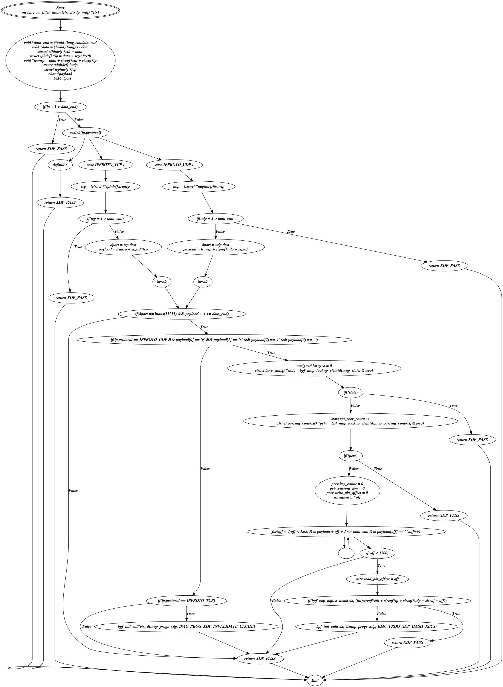

# CFG-dupath of C

## About

This is a fork of https://github.com/Xmr-nxbx/CFG-dupath-of-C

I use these scripts to generate CFG for simple C programs (mainly eBPF
programs).

## Requirements

* python3
* pycparser
* graphviz
* gcc

##  Usage

```
usage: main.py [-h] [--output-type OUTPUT_TYPE] cfile

positional arguments:
  cfile                 path to c file

optional arguments:
  -h, --help            show this help message and exit
  --output-type OUTPUT_TYPE
                        output file type
```

## Limitations

There are some problem in detecting statesment having struct refrences.
There might be other issues too.


## Example output

The result would probably look something like this.



